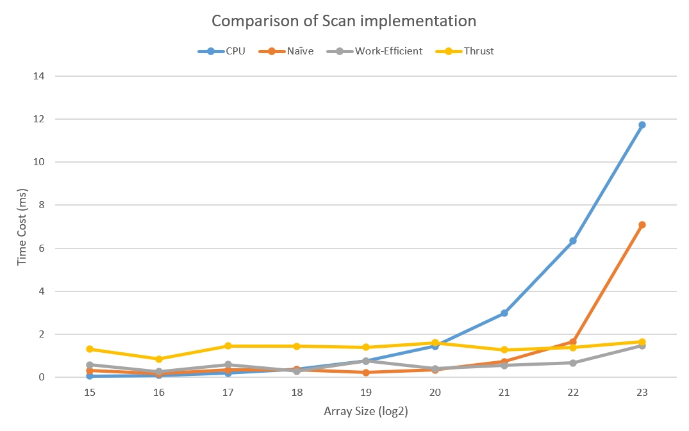

CUDA Stream Compaction
======================

**University of Pennsylvania, CIS 565: GPU Programming and Architecture, Project 2**

* Tianhong Zhou
  * [LinkedIn](https://www.linkedin.com/in/tianhong-zhou-b559aa159/)
* Tested on: Windows 11, i9-13950HX @ 2.20GHz, 32GB RAM, NVIDIA GeForce RTX 4060 Laptop GPU 8GB (Personal Laptop)

### Description

This project aims to let us be familiar with useful parallel algorithms such as scan, stream compaction and sort. I implemented the following features from scratch using CUDA within this project:

- CPU Scan & Stream Compaction
- Naive GPU Scan Algorithm
- Work-Efficient GPU Scan & Stream Campaction
- Thrust Scan
- Radix Sort

### Extra Credit

- Upgrade efficient scan
  - Optimizations:
    - Launch only the needed threads per level
    - Compute indices instead of using %
    - Remove per-level cudaDeviceSynchronize()
  - Results:
    - Efficient scan is faster than CPU scan
    ```
    ****************
    ** SCAN TESTS **
    ****************
        [  11  20  17  36  18  34  31  19   3  34  17   1  29 ...  14   0 ]
    ==== cpu scan, power-of-two ====
      elapsed time: 1.5536ms    (std::chrono Measured)
        [   0  11  31  48  84 102 136 167 186 189 223 240 241 ... 25654016 25654030 ]
    ==== cpu scan, non-power-of-two ====
      elapsed time: 1.494ms    (std::chrono Measured)
        [   0  11  31  48  84 102 136 167 186 189 223 240 241 ... 25653956 25653967 ]
        passed
    ==== work-efficient scan, power-of-two ====
      elapsed time: 0.679456ms    (CUDA Measured)
        passed
    ==== work-efficient scan, non-power-of-two ====
      elapsed time: 0.580768ms    (CUDA Measured)
        passed
    ```

- Implement radix sort
  - Usage:
    - Where: radix.h and radix.cu
    - Calling: StreamCompaction::Radix::sort(n, odata, idata)
  - Result
    ```
    **********************
    ** Radix Sort TESTS **
    **********************
        [  11  20  17  36  18  34  31  19   0   0   1   3   1 ...   0   0 ]
    ==== radix sort, power-of-two ====
      elapsed time: 5.67635ms    (CUDA Measured)
        [   0   0   0   0   0   1   1   3  11  17  18  19  20  31  34  36 ]
    ==== radix sort, non-power-of-two ====
      elapsed time: 4.63264ms    (CUDA Measured)
        [   0   0   1   1   3  11  17  18  19  20  31  34  36 ]
    ```

### Performance Aanalysis
- Using block size equals 128
- Plot of comparison

- Explanation:
  - What the plot shows:
    - Small array sizes: CPU is competitive or faster. GPU curves sit on a high constant "floor". That floor is mostly kernel-launch and synchronization overhead; for tiny inputs there isn't enough work to amortize it.
    - Mid array sizes: GPU starts to win. Work-Efficient and Thrust stay almost flat while CPU time begins to rise as data spills past cache.
    - Large array sizes: CPU time grows steeply. Naive scan also shoots up because its work is O(nlogn) with repeated global reads/writes per level. Work-Efficient remains the best and Thrust is close.
  - Bottlenecks and where they come from:
    - CPU scan:
      - Bottleneck: Memory hierarchy. For small n it's L1/L2 friendly; beyond cache it becomes memory-bandwidth bound, so time rises sharply.
    - Naive GPU scan:
      - Bottlenecks:
        - Global memory I/O O(nlogn) - every level touches the whole array.
        - Per-level kernel launches and (often) extra synchronizations.
        - Low effective occupancy on deep levels (few active threads).
      - Result: looks fine at mid sizes, then grows quickly for large n.
    - Work-Efficient GPU scan:
      - Bottlenecks: Still largely memory-bound, but total work is O(n). Launching only the needed threads per level and avoiding % reduces instruction/branch overhead. With one sync at the end, the curve stays low and scales well.
    - Thrust scan:
      - Bottlenecks: A relatively high constant overhead from internal temporaries and multiple kernels; Nsight typically shows several short kernels plus occasional stream syncs. Once amortized, runtime is near memory-bandwidth limit, hence the flat about 1 to 2 ms line. Using a caching allocator would lower the baseline further.

### Test Results
```
****************
** SCAN TESTS **
****************
    [  26   6  25   3   9  45  31  19  11   3  48  10   3 ...  40   0 ]
==== cpu scan, power-of-two ====
   elapsed time: 6.4118ms    (std::chrono Measured)
    [   0  26  32  57  60  69 114 145 164 175 178 226 236 ... 102742712 102742752 ]
==== cpu scan, non-power-of-two ====
   elapsed time: 6.4149ms    (std::chrono Measured)
    [   0  26  32  57  60  69 114 145 164 175 178 226 236 ... 102742648 102742651 ]
    passed
==== naive scan, power-of-two ====
   elapsed time: 1.53776ms    (CUDA Measured)
    passed
==== naive scan, non-power-of-two ====
   elapsed time: 1.41053ms    (CUDA Measured)
    passed
==== work-efficient scan, power-of-two ====
   elapsed time: 0.728704ms    (CUDA Measured)
    passed
==== work-efficient scan, non-power-of-two ====
   elapsed time: 0.560832ms    (CUDA Measured)
    passed
==== thrust scan, power-of-two ====
   elapsed time: 2.22547ms    (CUDA Measured)
    passed
==== thrust scan, non-power-of-two ====
   elapsed time: 0.542784ms    (CUDA Measured)
    passed

*****************************
** STREAM COMPACTION TESTS **
*****************************
    [   2   2   3   3   1   1   3   3   1   1   0   2   3 ...   0   0 ]
==== cpu compact without scan, power-of-two ====
   elapsed time: 7.3804ms    (std::chrono Measured)
    [   2   2   3   3   1   1   3   3   1   1   2   3   1 ...   1   2 ]
    passed
==== cpu compact without scan, non-power-of-two ====
   elapsed time: 8.9447ms    (std::chrono Measured)
    [   2   2   3   3   1   1   3   3   1   1   2   3   1 ...   1   1 ]
    passed
==== cpu compact with scan ====
   elapsed time: 18.7482ms    (std::chrono Measured)
    [   2   2   3   3   1   1   3   3   1   1   2   3   1 ...   1   2 ]
    passed
==== work-efficient compact, power-of-two ====
   elapsed time: 2.79437ms    (CUDA Measured)
    passed
==== work-efficient compact, non-power-of-two ====
   elapsed time: 1.93088ms    (CUDA Measured)
    passed

**********************
** Radix Sort TESTS **
**********************
    [  26   6  25   3   9  45  31  19   0   1   0   2   3 ...   0   1 ]
==== radix sort, power-of-two ====
   elapsed time: 7.0912ms    (CUDA Measured)
    [   0   0   1   1   2   3   3   3   3   6   9  19  25  26  31  45 ]
==== radix sort, non-power-of-two ====
   elapsed time: 5.36608ms    (CUDA Measured)
    [   0   0   1   2   3   3   6   9  19  25  26  31  45 ]
```

### CMakeLists
Add radix.h and radix.cu